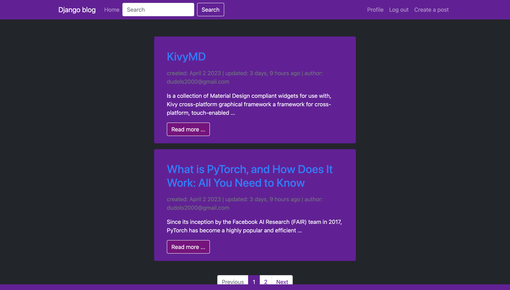
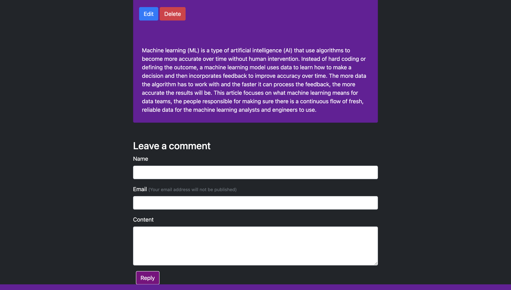
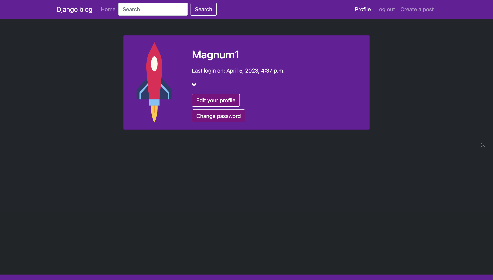
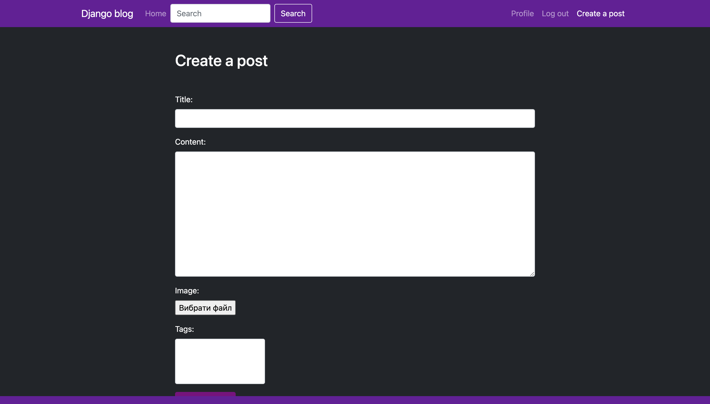
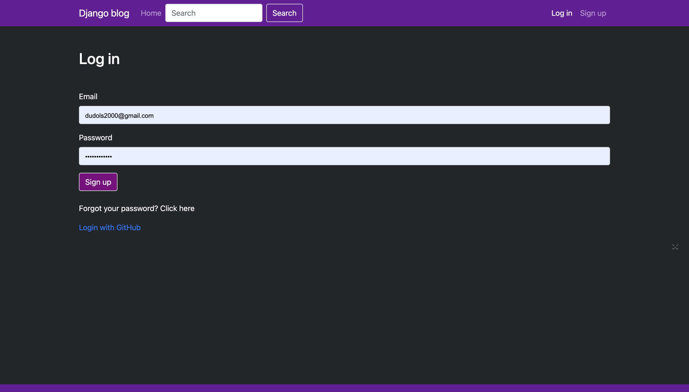
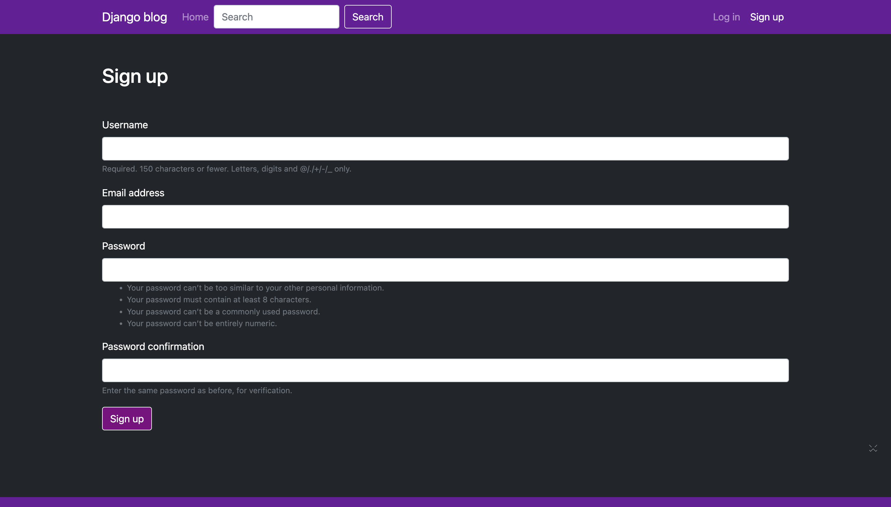

# Django Blog Application

A simple and customizable blog application built with Django. It allows users to create, edit, and delete blog posts, as well as leave comments on posts and log in using their GitHub account.


## Features

- User authentication and registration
- User profiles
- Password reset functionality
- Create, edit, and delete blog posts
- Add tags to blog posts
- Pagination for blog post list
- Leave comments on blog posts
- Login with GitHub


## Getting Started

These instructions will get you a copy of the project up and running on your local machine for development and testing purposes. See the deployment section for notes on how to deploy the project on a live system.


## Prerequisites

You will need Python (version 3.6 or higher) and pip installed on your local machine to run this project. You can download Python here and follow the installation instructions.


## Installation

1. Clone this repository:
```
git clone https://github.com/your_username/your_repository.git
```

4. Change the working directory to the project root:
```
cd your_repository
```

3. Create a virtual environment:
```
python -m venv venv
```

4. Activate the virtual environment:
- On Windows: venv\Scripts\activate
- On macOS and Linux:- source venv/bin/activate

5. Install the required packages:
```
pip install -r requirements.txt
```

6. Apply migrations:
```
python manage.py migrate
```

7. Create a superuser:
```
ython manage.py createsuperuser
```

8. Run the development server:
```
python manage.py runserver
```

Now, the application should be accessible at http://127.0.0.1:8000/.

## Deployment
To deploy this project on a live system, you can follow the official Django deployment guide: Deploying Django.

- 

- 

- 

- 

- 

- 
